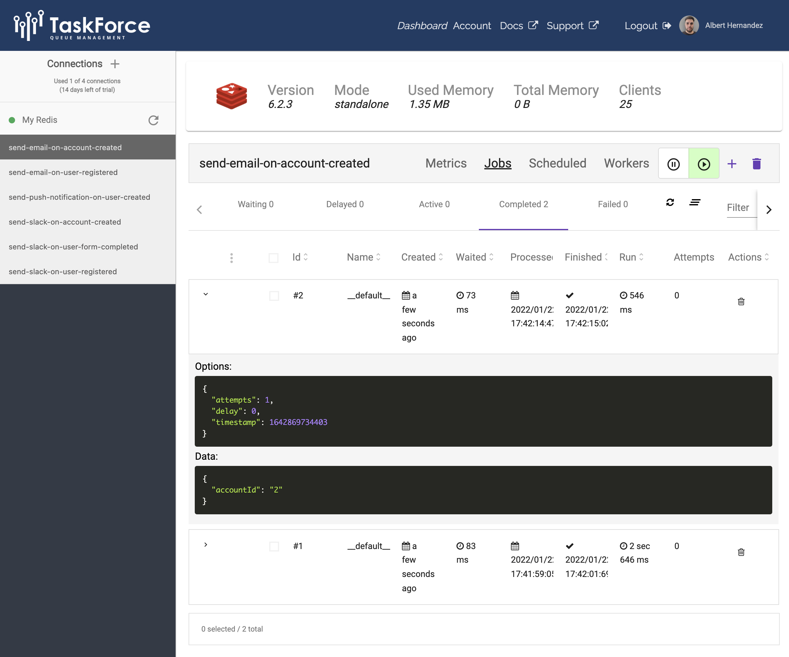

<h1 align="center">Bull Bus</h1>

<p align="center">
    <a href="https://github.com/AlbertHernandez/bull-bus/actions/workflows/nodejs.yml?branch=main"></a>
    <a href="https://www.npmjs.com/package/bull-bus"></a>
</p>

<p align="center">
  Event Bus for Node.JS using <a href="https://github.com/OptimalBits/bull">Bull</a> Queues
</p>

## Table of Contents

* [Installation](#installation)
* [How it works](#how-it-works)
* [How to Use It](#how-to-use-it)
    * [Bull Bus](#bull-bus)
    * [Bull Event Bus](#bull-event-bus)
    * [Visualization](#visualization)
* [Playground](#playground)
* [Preparing environment to contribute](#preparing-environment)
* [Building](#building)
* [Testing](#testing)
* [Linting](#linting)
* [Contributing](#contributing)

## Installation

```bash
npm install bull-bus
```

## How it works

When we work with event buses we normally have 1 event that can be consumed by N subscribers. When we want to create a new subscriber we will need to provide 3 main things:

* `Topic Name`: will be used to know the subscriptions that should be executed when a new topic is published.
* `Subscriber Name`: we can have N subscribers to a topic. The pair (topicName, subscriberName) will identify a unique subscription. Check how this is useful to [visualize](#visualization) the queues.
* `Handler`: this is the function that will be executed when an event is published to a particular topic.

## How to Use It

Bull Bus library offers two main functionalities. The bull bus and the bull event bus.

### Bull Bus

This class is a Bus Implementation using Bull, works with primitives data and does not know anything about the domain.
It may be useful in case we want to build our own domain event logic.

```ts
// Topic Name creations
const accountCreatedTopicName = "account-created";
const userCreatedTopicName = "user-created";

// Subscriber name creations
const sendEmailSubscriberName = "send-email";
const sendSlackSubscriberName = "send-slack";
const sendPushNotificationSubscriberName = "send-push-notification";

const bullBus = new BullBus({
  redisUrl: "redis://127.0.0.1:6379",
  topicNameToSubscriberNames: {
    [accountCreatedTopicName]: [
      sendEmailSubscriberName,
      sendSlackSubscriberName,
    ],
    [userCreatedTopicName]: [sendPushNotificationSubscriberName],
  },
});

bullBus.addSubscribers([
  {
    topicName: accountCreatedTopicName,
    handleEvent: async (payload: unknown) => {
      console.log("Handle Event Topic A, Handler 1 ", payload);
    },
    subscriberName: sendEmailSubscriberName,
  },
  {
    topicName: accountCreatedTopicName,
    handleEvent: async (payload: unknown) => {
      console.log("Handle Event Topic A, Handler 2 ", payload);
    },
    subscriberName: sendSlackSubscriberName,
  },
  {
    topicName: userCreatedTopicName,
    handleEvent: async (payload: unknown) => {
      console.log("payload handler B: ", payload);
    },
    subscriberName: sendPushNotificationSubscriberName,
  },
]);

await bullBus.publish(accountCreatedTopicName, {
  accountId: "2",
});

await bullBus.publish(userCreatedTopicName, {
  userId: "1",
});
```
### Bull Event Bus

Bull Event Bus is very similar to the Bull Bus with the difference that gives us some default classes to create domain
events and subscriptions. Its useful when we are working with OOP.

```ts
class UserRegistered extends DomainEvent {
  static EVENT_NAME = "user-registered";

  constructor(userName: string) {
    super({
      eventName: UserRegistered.EVENT_NAME,
      attributes: {
        userName,
      },
    });
  }
}

class UserFormCompleted extends DomainEvent {
  static EVENT_NAME = "user-form-completed";

  constructor(value: string) {
    super({
      eventName: UserFormCompleted.EVENT_NAME,
      attributes: {
        value,
      },
    });
  }
}

class SendSlackOnUserOrFormCompleted
  implements DomainEventSubscriber<UserRegistered | UserFormCompleted>
{
  subscribedTo() {
    return [UserRegistered, UserFormCompleted];
  }

  subscriberName(): string {
    return "send-slack";
  }

  async on(event: UserRegistered | UserFormCompleted) {
    switch (event.eventName) {
      case UserRegistered.EVENT_NAME:
        console.log("Simulating send slack...", event.attributes.userName);
        break;
      case UserFormCompleted.EVENT_NAME:
        console.log("Simulating send slack...", event.attributes.value);
        break;
    }
  }
}

class SendEmailOnUserRegistered
  implements DomainEventSubscriber<UserRegistered>
{
  subscribedTo() {
    return [UserRegistered];
  }

  subscriberName(): string {
    return "send-email";
  }

  async on(event: UserRegistered) {
    console.log("Simulating send email...", event.attributes.userName);
  }
}

const eventBus = new BullEventBus({
  redisUrl: "redis://127.0.0.1:6379",
  topicNameToSubscriberNames: {
    [UserRegistered.EVENT_NAME]: ["send-slack", "send-email"],
    [UserFormCompleted.EVENT_NAME]: ["send-slack"],
  },
});

eventBus.addSubscribers([
  new SendSlackOnUserOrFormCompleted(),
  new SendEmailOnUserRegistered(),
]);

await eventBus.publish([new UserRegistered("gabriel")]);
await eventBus.publish([new UserFormCompleted("3208")]);
```

### Visualization

Both buses are ready to show the internal queues to display the job data in a pretty way. The following image is using <a href="https://taskforce.sh/">Taskforce</a>, but can be used any UI for Bull.

<a href="https://github.com/AlbertHernandez/insomnia-plugin-ocean-light-theme">
    
</a>

## Playground

This library offers a playground where we can play with the functions that we are developing

```bash
docker-compose up -d redis
npm run playground
```

## Preparing environment to contribute

This library has been designed to work with node v16 and npm 8. In order to configure your local environment you can
run:

```bash
nvm install 16.0.0
nvm use
npm install npm@8.3.0 -g
npm install
```

## Building

```bash
npm run build
```

## Testing

### Jest with Testing Library

```bash
npm run test
```

## Linting

Run the linter

```bash
npm run lint
```

Fix lint issues automatically

```bash
npm run lint:fix
```

## Contributing

Contributions welcome! See
the [Contributing Guide](https://github.com/AlbertHernandez/bull-bus/blob/main/CONTRIBUTING.md).
